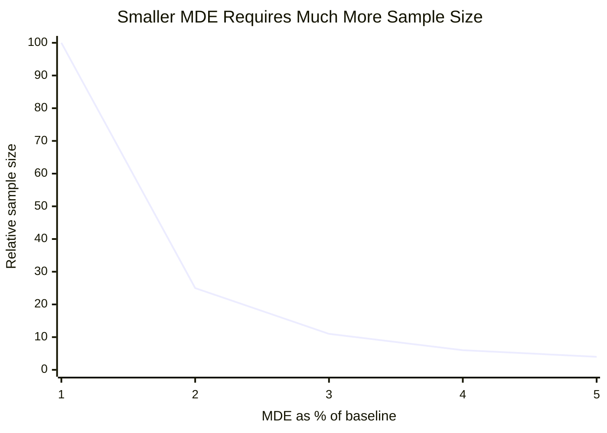
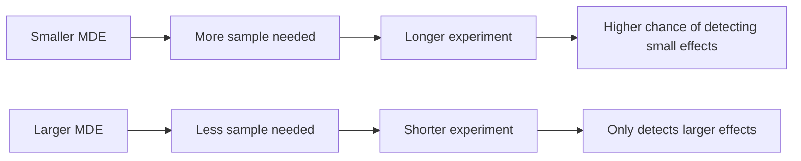

# Designing a Clean Experiment

A good experiment is mostly designed before the first user enters it.

Once the data arrives, the analysis may feel like the main event: p-values, confidence intervals, dashboards, and launch decisions. But many experiment failures are already built into the design. If the wrong users enter the test, if treatment and control are not clearly defined, if the randomization unit is unstable, or if the metric does not match the product goal, no statistical method can fully rescue the result later.

Clean experiment design starts with a simple question:

> What comparison do we want to make, and under what conditions would we trust the answer?

This chapter walks through the main design choices behind a reliable A/B test.

## From Product Idea to Hypothesis

A product idea is not yet an experiment.

Consider these product ideas:

- Add one-click checkout
- Change the recommendation algorithm
- Show a delivery time range
- Redesign onboarding
- Add a discount reminder

Each idea needs to be translated into a hypothesis.

A weak hypothesis sounds like:

> The new onboarding flow will be better.

A stronger hypothesis sounds like:

> The new onboarding flow will increase trial starts per eligible visitor without reducing paid conversion or 30-day retention.

The stronger version is better because it says what should improve and what should not get worse.

A useful experiment hypothesis usually contains:

- The target population
- The product change
- The expected direction of impact
- The primary outcome
- The main guardrails

For example:

> Among users viewing checkout, showing a simplified checkout page will increase purchase conversion rate without reducing revenue per visitor or increasing payment errors.

This is now close to a testable experiment.

## Eligibility: Who Enters the Experiment?

Eligibility defines who can be included in the experiment.

This sounds simple, but it is one of the most important design choices. If the experiment includes users who could never experience the treatment, the measured effect will be diluted. If it includes only users who take a post-treatment action, the analysis may be biased.

Suppose a job platform tests a one-click apply button. The feature only works for users who have a saved resume and completed profile. If all job page visitors are included, many users in treatment cannot actually use the new feature. The experiment may underestimate the effect among eligible users.

A cleaner eligibility rule would be:

> Users who view an application page and have enough saved profile information to use one-click apply.

Eligibility should be defined before randomization whenever possible. Defining it after treatment exposure can introduce bias.

Good eligibility rules answer:

- Who can actually receive the treatment?
- At what moment does a user enter the experiment?
- Are there users or contexts that should be excluded?
- Is eligibility based on pre-treatment information?

## Treatment and Control

Treatment and control should differ in exactly the intended way.

In a clean A/B test:

- Control receives the current experience
- Treatment receives the new experience

But in real products, the difference may be less clean. A checkout redesign might also change page load time. A recommendation update might change both ranking and content diversity. A notification experiment might change timing, copy, and frequency all at once.

The more things change at the same time, the harder it becomes to interpret the result.

Suppose a food delivery app tests showing delivery time as a range instead of a point estimate. If treatment also changes the color, placement, and wording of the delivery estimate, then a metric movement cannot be attributed only to the range format.

The design question is:

> What exactly is the treatment?

A good experiment document should specify:

- What control users see
- What treatment users see
- Where the change appears
- Whether the change is consistent across surfaces
- Whether any backend logic changes
- What version or configuration is being tested

This level of detail prevents confusion later, especially when results are surprising.

## Randomization Unit

The randomization unit is the level at which treatment assignment happens.

Common choices include:

- User
- Session
- Device
- Page view
- Item or listing
- Creator or seller
- Store or restaurant
- City or region
- Time block

The right unit depends on how the treatment works and how interference might happen.

User-level randomization is common because it gives a consistent experience. If a user sees the new checkout page today, they should usually see it again tomorrow. This avoids confusion and contamination.

Session-level randomization may be useful when the experience is short-lived and users rarely return, but it can create inconsistency for returning users.

Item-level or creator-level randomization may be needed when the treatment is attached to content rather than users. For example, if a marketplace tests a new seller badge, randomizing users may mean the same seller appears with a badge to some buyers but not others. Randomizing sellers may be cleaner.

Geo-level or time-level randomization is often used when users affect each other, such as in ride-sharing, food delivery, ads auctions, and marketplaces. These cases are discussed later in the book under interference and switchback experiments.

The rule of thumb is:

> Randomize at the lowest level that keeps the treatment stable and avoids major contamination.

### Hash-Based User Randomization

When the randomization unit is the user, many experimentation systems assign users with a deterministic hash.

The basic idea is simple:

1. Take a stable user identifier, such as `user_id`.
2. Combine it with an experiment identifier, such as `checkout_redesign_v1`.
3. Hash the combined string into a number.
4. Map that number into a bucket.
5. Assign buckets to control or treatment.

For example:

```text
hash_input = user_id + ":" + experiment_id
bucket = hash(hash_input) % 10000

if bucket < 5000:
    assignment = "control"
else:
    assignment = "treatment"
```

This creates a stable 50/50 split. The same user will receive the same assignment every time the experiment is checked, because the hash input does not change.

For a 10% treatment rollout, the assignment could be:

```text
if bucket < 9000:
    assignment = "control"
else:
    assignment = "treatment"
```

For a three-arm experiment:

```text
if bucket < 3333:
    assignment = "control"
elif bucket < 6666:
    assignment = "treatment_a"
else:
    assignment = "treatment_b"
```

The experiment identifier is important. If the platform hashes only `user_id`, then the same users may repeatedly fall into treatment across many experiments. By hashing `user_id` together with `experiment_id`, each experiment gets a fresh random split while keeping assignment stable inside that experiment.

A more general version is:

$$
\text{bucket}_i
=
h(\text{user_id}_i, \text{experiment_id}) \bmod B
$$

where $B$ is the number of available buckets. If $B = 10{,}000$, then each bucket represents roughly 0.01% of eligible users.

Hash-based assignment has several advantages:

- It is deterministic.
- It does not require storing every assignment in a database.
- It gives users a consistent experience across visits.
- It supports gradual rollout by changing which buckets receive treatment.
- It makes the expected traffic split easy to audit.

For example, a team can start with 5% treatment, then expand to 25%, then 50% by adding more buckets to treatment.

However, bucket expansion needs care. If users are moved from control to treatment during the experiment, the meaning of the experiment changes. For a clean A/B test, the assignment rule should usually be fixed before the experiment starts. Gradual rollout is useful for safety monitoring, but the confirmatory analysis should clearly define which users and time periods belong to the final experiment.

There are also common pitfalls.

**Unstable identifiers**

If the user identifier changes across devices, sessions, logout states, or reinstall events, the same person may receive different variants.

For example, randomizing by device ID may be reasonable for a device-specific UI test, but it may be wrong for a subscription experiment where the same user moves across phone, tablet, and desktop.

**Randomizing after exposure**

Assignment should happen before treatment exposure. If the system assigns users only after they click a feature or reach a late funnel step, the experiment population may already be selected by post-treatment behavior.

**Changing the hash rule mid-experiment**

Changing the salt, experiment ID, bucket count, or allocation logic can reshuffle users. This breaks treatment stability and can contaminate the result.

**Correlated assignments across experiments**

If multiple experiments use the same hash input and bucket ranges, the same users may be assigned together across experiments. Experiment-specific salts or identifiers help make assignments independent across experiments.

**Ignoring missing IDs**

Some traffic may not have a reliable `user_id`, such as logged-out visitors. The experiment design should define how to handle these users: exclude them, randomize by anonymous ID, or use another stable identifier.

**Not checking the assignment split**

After launch, the team should check whether the observed split matches the planned split. A 50/50 experiment that receives 55/45 traffic may indicate a sample ratio mismatch, logging problem, eligibility bug, or inconsistent assignment.

Hash-based randomization is not the only possible implementation, but it is the most common pattern. The principle is more important than the exact code:

> Use a stable identifier and a deterministic randomization rule so assignment is consistent, auditable, and independent of user behavior.

## Exposure and Triggered Users

Assignment is not the same as exposure.

A user may be assigned to treatment but never actually see the feature. For example:

- A user assigned to a checkout experiment never reaches checkout
- A user assigned to a recommendation experiment does not open the feed
- A user assigned to one-click apply has no saved resume
- A user assigned to a pricing experiment visits only free pages

This creates two related populations:

**Assigned users**

Users included in the experiment assignment.

**Triggered users**

Users who actually had a chance to experience the treatment.

Analyzing all assigned users gives an intent-to-treat estimate. It answers:

> What is the effect of assigning users to this product experience?

Analyzing triggered users can be more sensitive, because it focuses on users who could actually be affected. But it must be done carefully. If triggering is affected by the treatment, analyzing only triggered users can introduce bias.

A good design defines the trigger event in advance.

For example:

> A user enters the checkout experiment when they land on the checkout page.

This is cleaner than assigning all site visitors and later filtering to only those who reached checkout, especially if the treatment could affect whether users reach checkout.

## Metrics

Chapter 1 introduced primary, secondary, and guardrail metrics. In experiment design, the important point is that metrics should be chosen before looking at results.

The primary metric should match the decision. If the decision is whether to launch a checkout page, revenue per visitor may matter more than button click rate. If the decision is whether to launch a safety-sensitive recommendation model, reported content may be a hard guardrail even if watch time improves.

Secondary metrics explain the mechanism. Guardrails protect against unintended harm.

A useful metric set has balance:

- One primary metric for the main decision
- A small number of secondary metrics for interpretation
- A small number of guardrails for safety and product health

Too many metrics create noise and make it easier to tell a convenient story after the fact. Too few metrics make it hard to understand what happened.

## Sample Size, MDE, and Duration

Before launching an experiment, the team should estimate how much data is needed.

This is called power analysis. Its goal is to answer a practical question:

> If the treatment has an effect large enough to matter, how many users do we need in order to detect it reliably?

The key inputs are:

- Baseline metric value
- Minimum detectable effect, or MDE
- Significance level, usually called alpha
- Power, which equals 1 - beta
- Metric variance
- Daily eligible traffic

### Alpha, Beta, and Power

Alpha is the false positive rate. If alpha is 0.05, the experiment allows a 5% chance of incorrectly detecting an effect when the treatment actually has no effect.

Beta is the false negative rate. If beta is 0.20, the experiment has a 20% chance of missing the effect size it was designed to detect.

Power is:

$$
\text{Power} = 1 - \beta
$$

So if beta is 0.20, power is 80%.

A common setup is:

$$
\alpha = 0.05,\quad \beta = 0.20,\quad \text{power} = 80\%
$$

### Minimum Detectable Effect

The minimum detectable effect is the smallest effect the experiment is designed to detect with the chosen power.

If the baseline conversion rate is 10%, and the team wants to detect a 5% relative lift, then:

$$
\text{MDE} = 10\% \times 5\% = 0.5\text{ percentage points}
$$

So the experiment is designed to detect a change from 10.0% to 10.5%.

This distinction matters:

- Relative lift: 5%
- Absolute lift: 0.5 percentage points

Sample size calculations usually use the absolute lift.

### Sample Size for a Difference in Means

For a continuous metric such as revenue per user, session duration, or GMV per user, a simple approximation for equal-sized treatment and control groups is:

$$
n \approx \frac{2(z_{1-\alpha/2} + z_{1-\beta})^2 \sigma^2}{\delta^2}
$$

Where:

- $n$ is the required sample size per group
- $\sigma^2$ is the metric variance
- $\delta$ is the minimum detectable effect in absolute units
- $z_{1-\alpha/2}$ comes from the significance level
- $z_{1-\beta}$ comes from the desired power

For a two-sided test with alpha = 0.05 and power = 80%:

$$
z_{1-\alpha/2} \approx 1.96,\quad z_{1-\beta} \approx 0.84
$$

So:

$$
(z_{1-\alpha/2} + z_{1-\beta})^2 \approx (1.96 + 0.84)^2 = 7.84
$$

The formula becomes approximately:

$$
n \approx \frac{15.68\sigma^2}{\delta^2}
$$

This equation shows the most important relationship in sample size planning:

> Required sample size grows with variance and shrinks with the square of the MDE.

If the MDE is cut in half, the required sample size becomes about four times larger.



### Sample Size for a Conversion Rate

For a binary metric such as conversion rate, signup rate, or click-through rate, the metric variance is tied to the baseline rate.

If the control conversion rate is $p_C$, the treatment conversion rate is $p_T$, and the absolute MDE is:

$$
\delta = p_T - p_C
$$

Then an approximate sample size per group is:

$$
n \approx \frac{(z_{1-\alpha/2} + z_{1-\beta})^2[p_C(1-p_C) + p_T(1-p_T)]}{\delta^2}
$$

When the expected effect is small, $p_T$ is close to $p_C$, so a simpler approximation is:

$$
n \approx \frac{2(z_{1-\alpha/2} + z_{1-\beta})^2p(1-p)}{\delta^2}
$$

where $p$ is the baseline conversion rate.

For example, suppose:

- Baseline conversion rate: 10%
- Desired relative lift: 5%
- Absolute MDE: 0.5 percentage points
- Alpha: 0.05
- Power: 80%

Then:

$$
p = 0.10,\quad \delta = 0.005
$$

Using the approximation:

$$
n \approx \frac{2(1.96 + 0.84)^2(0.10)(0.90)}{0.005^2}
$$

$$
n \approx 56{,}448
$$

So the experiment needs about 56,000 users per group, or about 112,000 users total.

### From Sample Size to Duration

Once the sample size is estimated, duration depends on eligible traffic.

If the experiment needs 112,000 users total and the product has 20,000 eligible users per day, then the minimum duration is:

$$
\text{Duration} = \frac{112{,}000}{20{,}000} = 5.6\text{ days}
$$

But experiments should usually cover full business cycles. If user behavior differs between weekdays and weekends, the test should run for at least one full week, even if the required sample size is reached earlier.

For metrics with delayed outcomes, duration also needs to include observation time. A trial conversion experiment may need one week to collect users and another week or month to observe whether they convert.

### The Planning Tradeoff

Sample size planning is not just a statistical exercise. It is a business decision.

A smaller MDE means the team can detect smaller improvements, but the experiment will need more users and more time.

A larger MDE means the experiment can finish faster, but it may miss smaller effects that still matter.



A good experiment plan should make this tradeoff explicit:

- What effect size would be meaningful for the business?
- How long would it take to detect that effect?
- Is the required duration realistic?
- Are there ways to reduce variance, such as CUPED or stratification?
- Are delayed metrics or seasonality likely to require a longer test?

The goal is not to calculate a perfect number. The goal is to avoid running an experiment that is too small to answer the question it was designed to answer.

## Validity Checks

Before interpreting experiment results, basic validity checks should pass.

Important checks include:

**Sample ratio mismatch**

Did traffic split as expected? If the experiment was designed as 50/50, but the result is 55/45, something may be wrong with assignment, logging, or eligibility.

**Logging correctness**

Were exposure and outcome events recorded correctly for both groups?

**Baseline balance**

Do treatment and control look similar on pre-treatment variables?

**Contamination**

Could users see both treatment and control experiences?

**Interference**

Could one user's treatment affect another user's outcome?

**Novelty effects**

Are users reacting temporarily because the experience is new?

**External shocks**

Did marketing campaigns, outages, holidays, or operational issues affect one group more than the other?

These checks are not glamorous, but they prevent expensive mistakes.

## A Full Design Example

Suppose a food delivery app wants to test showing users an estimated delivery time range, such as "25-35 minutes," instead of a single estimate, such as "30 minutes."

The product goal is to set better expectations and reduce frustration around delivery time.

A possible hypothesis is:

> Showing a delivery time range will reduce post-order cancellations and delivery-time complaints without reducing order conversion.

Eligible users:
- Users who view a restaurant page or checkout page where a delivery estimate is shown

Treatment:
- Users see a delivery estimate range, such as "25-35 minutes"

Control:
- Users see a point estimate, such as "30 minutes"

Randomization unit:
- User level, so the experience is consistent across sessions and surfaces

Primary metric:
- Delivery-time-related complaint rate or post-order cancellation rate

Secondary metrics:
- Time from order placement to cancellation
- Clicks on delivery tracking or delivery details
- Difference between estimated and actual delivery time
- Delivery-time satisfaction rating

Guardrail metrics:
- Restaurant page to checkout conversion
- Checkout completion rate
- Order conversion rate
- Refund or credit request rate
- Support contact rate
- Repeat order rate

Duration:
- Based on baseline complaint or cancellation rate, MDE, alpha, power, and daily eligible traffic
- Run for at least full weekly cycles to cover weekday and weekend ordering patterns

Validity risks:
- Users may see a point estimate on one surface and a range on another
- Weather or courier supply shocks may affect delivery experience
- Logging may capture estimate exposure inconsistently
- The range may affect order conversion before it affects complaints
- Users may initially react differently because the format is new

This design is not complicated, but it is precise. It defines who enters, what changes, what success means, what harm to watch for, and what could make the result untrustworthy.

## Key Takeaways

A clean experiment starts before data collection.

A product idea must be translated into a testable hypothesis.

Eligibility should be based on users who can actually experience the treatment.

Treatment and control should differ in the intended way.

The randomization unit should keep the experience stable and avoid contamination.

Assignment is not the same as exposure.

Metrics should be chosen before looking at results.

Sample size and duration should be planned around MDE, power, traffic, and time patterns.

Validity checks are essential before trusting the result.
