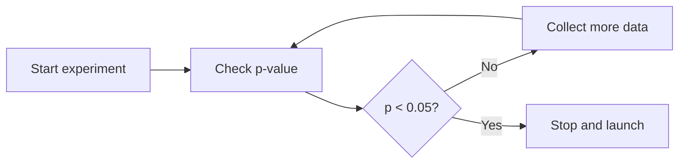

# The Peeking Problem

Experiments are hard to ignore while they are running.

Once a dashboard starts updating, people naturally want to look. A product manager wants to know whether the launch is promising. An engineer wants to make sure nothing is broken. A leadership team wants to know whether the feature can ship early. The data is visible, and the decision pressure is real.

The problem is not looking. The problem is changing the decision rule after looking.

A standard fixed-horizon A/B test assumes that the team decides the sample size and duration in advance, waits until the planned end, and then performs the statistical test once. If the team checks the p-value every day and stops the first time it becomes significant, the experiment is no longer following the fixed-horizon design.

That behavior is called peeking, optional stopping, or continuous monitoring. If it is not handled correctly, it increases the false positive rate.

This chapter explains why peeking breaks ordinary tests, when monitoring is still acceptable, and what methods allow valid early stopping.

## The Fixed-Horizon Assumption

The most common A/B test is a fixed-horizon test.

Before the experiment begins, the team decides:

- The primary metric
- The significance level, such as $\alpha = 0.05$
- The desired power
- The minimum detectable effect
- The required sample size
- The planned duration

At the end of the experiment, the team compares treatment and control.

For a two-sided test with $\alpha = 0.05$, the rule is often:

> Reject the null hypothesis if $p < 0.05$.

This rule controls the false positive rate under the fixed-horizon design. If the treatment truly has no effect, then the probability of incorrectly declaring a significant effect is 5%.

That 5% guarantee depends on the test being run once at the planned endpoint.

## Why Peeking Inflates False Positives

Suppose the treatment has no real effect. Treatment and control are the same.

Even then, random noise will make the treatment look better on some days and worse on others. The p-value moves as more data arrives. If the team checks the p-value repeatedly, it gets many chances to see a lucky fluctuation.

The decision rule silently changes from:

> Launch if the final p-value is below 0.05.

to:

> Launch if any p-value during the experiment is below 0.05.

Those are not the same rule.

The second rule has a higher false positive rate because it gives noise more opportunities to look convincing.

This loop is the peeking problem. The threshold may still say 0.05, but the true false positive rate is larger because the test has been repeated many times.

## A Simple Intuition

Imagine rolling a fair die and declaring success if it lands on six.

If the die is rolled once, the probability of success is:

$$
\frac{1}{6} \approx 16.7\%
$$

If the die is rolled ten times and success is declared if any roll is a six, the probability of success is:

$$
1 - \left(\frac{5}{6}\right)^{10} \approx 83.8\%
$$

The definition of success changed from "a six on one roll" to "at least one six across many rolls."

Peeking creates a similar problem. Each interim look gives the experiment another chance to cross the significance threshold by luck.

The exact inflation depends on how often the team looks, how correlated the looks are, and what stopping rule is used. But the direction is clear: repeated unplanned testing makes false positives more likely.

## What Kind of Monitoring Is Still Okay?

Not every look at an experiment is bad.

Teams often need to monitor experiments for operational reasons:

- Is traffic assigned correctly?
- Is there sample ratio mismatch?
- Are exposure events logging correctly?
- Are guardrails showing severe harm?
- Is the feature crashing or slowing down the product?

This type of monitoring is not the same as fishing for a significant win. It is quality control and safety monitoring.

The risky behavior is using ordinary fixed-horizon p-values to make an early success decision:

> The result is significant today, so stop the experiment and launch.

If early stopping is possible, the stopping rule should be designed before the experiment starts.

## Group Sequential Testing

Group sequential testing allows interim looks while controlling the overall false positive rate.

Instead of checking whenever someone feels curious, the team predefines a small number of analysis checkpoints.

For example:

- Look 1: after 25% of the planned sample
- Look 2: after 50% of the planned sample
- Look 3: after 75% of the planned sample
- Final look: after 100% of the planned sample

At each look, the experiment can stop early if the evidence is strong enough. But the significance threshold is adjusted so that the total false positive rate across all looks remains controlled.

The idea is:

> Spend the total alpha budget across multiple interim analyses.

If the total alpha is 0.05, the experiment cannot spend 0.05 at every look. It must allocate alpha across the looks.

## Pocock and O'Brien-Fleming Boundaries

Two common group sequential boundary styles are Pocock and O'Brien-Fleming.

Pocock-style boundaries use a similar threshold at each look. The early threshold is stricter than 0.05, but not extremely strict.

O'Brien-Fleming-style boundaries are very strict early and become closer to 0.05 near the final look.

For a concrete example, suppose the experiment uses a two-sided test with total $\alpha = 0.05$ and four equally spaced looks at 25%, 50%, 75%, and 100% of the planned information.

A group sequential design is usually described in terms of a test statistic $Z_k$ at look $k$. Under the null hypothesis, the vector of interim $Z$-statistics is correlated because later looks contain much of the same data as earlier looks. If the information fraction at look $k$ is $t_k$, then a common approximation is:

$$
\text{Corr}(Z_i, Z_j) =
\sqrt{\frac{\min(t_i,t_j)}{\max(t_i,t_j)}}
$$

Thresholds are chosen so that the probability of crossing any boundary under the null equals the total alpha:

$$
P_0\left(\max_k |Z_k| > b_k\right) = \alpha
$$

For four equally spaced looks, approximate two-sided nominal p-value thresholds are:

| Look | Information Fraction | Naive Fixed-Horizon | Pocock Approximation | O'Brien-Fleming Approximation |
|---:|---:|---:|---:|---:|
| 1 | 25% | 0.05 | 0.018 | 0.00005 |
| 2 | 50% | 0.05 | 0.018 | 0.004 |
| 3 | 75% | 0.05 | 0.018 | 0.019 |
| 4 | 100% | 0.05 | 0.018 | 0.043 |

The corresponding O'Brien-Fleming-style $Z$-boundaries are approximately:

$$
b_k = \frac{2.024}{\sqrt{t_k}}
$$

So for $t = 0.25, 0.50, 0.75, 1.00$, the $Z$-boundaries are about:

$$
4.05,\quad 2.86,\quad 2.34,\quad 2.02
$$

The corresponding Pocock-style boundary is approximately constant:

$$
b_k \approx 2.36
$$

which corresponds to a two-sided nominal p-value of about 0.018 at each look.

These numbers are illustrative, not universal. Exact thresholds depend on the number of looks, one-sided versus two-sided testing, information timing, and the specific sequential design. But the pattern is the important part: early looks require stronger evidence than an ordinary fixed-horizon test.

The practical difference is:

- Pocock gives a better chance of stopping earlier, but uses a stricter final threshold.
- O'Brien-Fleming makes early stopping harder, but keeps the final threshold close to the usual fixed-horizon threshold.

For many product experiments, O'Brien-Fleming-style monitoring is attractive because it allows early stopping for very strong effects without sacrificing much power at the planned endpoint.

## Alpha Spending

Alpha spending is a flexible way to design sequential monitoring.

Instead of fixing exact look times in a rigid way, the experiment defines an alpha spending function. This function describes how much of the total false positive budget can be spent as information accumulates.

The information fraction is often approximated by:

$$
\text{Information fraction} =
\frac{\text{sample size observed so far}}{\text{planned total sample size}}
$$

At 50% of the sample, the test has roughly 50% of the planned information. At 100%, it has all of it.

An alpha spending rule might spend very little alpha early and more alpha near the end. This gives the team a principled way to monitor while preserving the overall Type I error rate.

The important point is not the exact function. The important point is that the peeking plan is part of the design, not an improvised reaction to a promising dashboard.

## Sequential Tests and Always-Valid Inference

Another family of methods is designed for continuous monitoring.

These methods produce evidence measures that remain valid even when the experiment is checked repeatedly. Examples include:

- Sequential probability ratio tests
- Always-valid p-values
- Confidence sequences
- E-values

The details differ, but the goal is similar:

> Allow the team to monitor results over time without invalidating inference through optional stopping.

### Sequential Probability Ratio Test

The sequential probability ratio test, or SPRT, compares two specific hypotheses:

$$
H_0: \text{effect} = 0
$$

and:

$$
H_1: \text{effect} = \delta
$$

As data arrives, the test updates the likelihood ratio:

$$
\Lambda_t =
\frac{P(\text{data up to time }t \mid H_1)}
{P(\text{data up to time }t \mid H_0)}
$$

The decision rule uses two boundaries:

$$
A = \frac{1-\beta}{\alpha},\quad
B = \frac{\beta}{1-\alpha}
$$

If $\Lambda_t \ge A$, stop and reject $H_0$. If $\Lambda_t \le B$, stop for $H_0$. Otherwise, continue collecting data.

For example, with $\alpha = 0.05$ and $\beta = 0.20$:

$$
A = \frac{0.80}{0.05} = 16,\quad
B = \frac{0.20}{0.95} \approx 0.21
$$

So the data must become at least 16 times more likely under the alternative than under the null before the test stops for success.

SPRT is powerful when the hypotheses are simple and the effect size of interest is clear. In many product experiments, however, the treatment effect is not a single fixed value, so teams often use generalized sequential methods rather than a plain SPRT.

### Always-Valid P-Values

An always-valid p-value is designed so that optional stopping does not break Type I error control.

The decision rule can be simple:

> Stop for success the first time the always-valid p-value is below $\alpha$.

The difference from ordinary p-values is that this rule remains valid even if the team checks the result many times. The p-value process is constructed to account for repeated monitoring.

In practice, this means the experiment platform may show two different values:

- A fixed-horizon p-value, valid at the planned endpoint
- An always-valid p-value, valid under continuous monitoring

Only the second one should be used for optional stopping.

### Confidence Sequences

A confidence sequence is like a confidence interval that is valid across time. Instead of saying, "This interval has 95% coverage at the final planned sample size," it aims to say, "This sequence of intervals maintains coverage even as the sample grows and the analyst looks repeatedly."

For a treatment effect $\tau$, a 95% confidence sequence gives an interval at each time $t$:

$$
[L_t, U_t]
$$

with the property that the full sequence covers the true effect with high probability:

$$
P\left(\forall t,\ \tau \in [L_t, U_t]\right) \ge 95\%
$$

A practical decision rule might be:

- Stop for success if $L_t > 0$
- Stop for harm if $U_t < 0$
- Stop for practical success if $L_t$ is above the minimum meaningful effect
- Continue if the interval still overlaps the decision boundary

Confidence sequences are especially useful when the team wants to see an uncertainty interval over time, not just a stop-or-continue signal.

### E-Values

An e-value is another way to measure evidence against the null. Under the null hypothesis, an e-value is nonnegative and has expectation at most 1:

$$
E_0[E_t] \le 1
$$

The useful property comes from Ville's inequality:

$$
P_0\left(\sup_t E_t \ge \frac{1}{\alpha}\right) \le \alpha
$$

This means a valid stopping rule is:

> Stop and reject the null if $E_t \ge 1/\alpha$.

For $\alpha = 0.05$, the threshold is:

$$
\frac{1}{0.05} = 20
$$

So the e-value must reach 20 before the experiment stops for success.

E-values are useful because they can be monitored continuously and combined across data streams in principled ways. They are less familiar to many product teams than p-values or confidence intervals, so they usually require more education and tooling.

This is useful when experiments need flexible stopping, such as:

- Stop early for a large positive effect
- Stop early for harm
- Stop early for futility
- Continue if the result is uncertain

Sequential methods can be more complex to implement than fixed-horizon tests, but they match how many product teams naturally want to operate. The key is that the monitoring method must be chosen before the team starts making stop-or-continue decisions.

## Bayesian Monitoring

Bayesian methods are often described as allowing peeking. That is partly true, but it needs care.

In a Bayesian experiment, the team starts with a prior belief about the treatment effect and updates it as data arrives. The result is a posterior distribution.

Instead of asking:

> Is $p < 0.05$?

a Bayesian analysis might ask:

> What is the posterior probability that treatment is better than control?

or:

> What is the probability that treatment improves revenue per user by at least 1%?

This can feel more natural for decision-making. For example:

$$
P(\text{lift} > 0 \mid \text{data}) = 99\%
$$

But Bayesian monitoring still needs a predefined decision rule.

For example:

> Stop and launch if $P(\text{lift} > 0) > 99\%$ and the expected loss from launching is below a business threshold.

or:

> Stop for harm if $P(\text{guardrail degradation} > 1\%) > 95\%$.

Without a clear rule, Bayesian dashboards can still encourage unstable decisions. The team may keep checking until the posterior probability looks attractive, then stop. That may be acceptable under a Bayesian decision framework if the rule is well-defined, but it may not satisfy a company that wants frequentist false positive guarantees.

The practical lesson is:

> Bayesian methods make monitoring natural, but they do not remove the need for disciplined decision rules.

## Stopping for Harm Versus Stopping for Success

Early stopping for harm is different from early stopping for success.

If a treatment causes severe crashes, payment failures, safety issues, or large revenue loss, the team should stop the experiment. Protecting users and the business comes first.

But stopping for harm should still be interpreted carefully. A severe guardrail violation may justify stopping operationally, even if the exact treatment effect estimate is noisy. The purpose is risk control.

Stopping early for success requires stronger statistical discipline because it creates the temptation to launch on a lucky positive fluctuation.

This leads to a useful distinction:

- Safety monitoring protects users and systems.
- Success monitoring supports a positive launch decision.

Both are valid, but success monitoring needs an appropriate sequential design if it can change the experiment endpoint.

## Futility Stopping

Sequential designs can also stop experiments early when success becomes unlikely.

This is called futility stopping.

Suppose an experiment is halfway through and the observed treatment effect is close to zero. A futility analysis may estimate that even if the experiment continues to the planned sample size, it is unlikely to detect the target effect.

Stopping for futility can save traffic, time, and engineering attention.

But futility rules should also be predefined. Otherwise, a team may stop experiments that look disappointing early, while continuing experiments that look promising. That creates selection bias in what results get completed and reported.

## Bandits Are Not the Same as Sequential Tests

Multi-armed bandits also use incoming data while an experiment is running, but they serve a different goal.

A traditional A/B test is mainly designed for measurement:

> What is the causal effect of treatment compared with control?

A bandit is mainly designed for optimization:

> How can we allocate more traffic to better-performing variants while learning?

Bandits can reduce regret because fewer users are assigned to weak variants over time. This is useful for:

- Ad creatives
- Notification copy
- Email subject lines
- Homepage modules
- Promotion selection

But bandits are often less clean for estimating a final treatment effect, especially when:

- Metrics are delayed
- User mix changes over time
- There is seasonality
- The decision requires a precise causal estimate

Bandits are discussed later in the book. For this chapter, the key point is that adaptive allocation is not a free version of peeking. It is a different experimental design with a different objective.

## A Product Example

Suppose a subscription app tests a new onboarding flow. The planned experiment duration is 28 days, with the primary metric defined as paid subscribers per onboarding entrant.

After 7 days, signup completion is up and the p-value for trial starts is below 0.05. The team wants to stop early and launch.

Under a fixed-horizon design, this would be a mistake for three reasons.

First, trial starts are not the primary metric. Paid conversion after trial is delayed, so the main outcome has not fully appeared.

Second, the p-value was checked before the planned endpoint. If the team stops just because an early metric is significant, the false positive rate is no longer controlled.

Third, early users may not represent the full experiment population. Weekday and weekend behavior, acquisition channel mix, or novelty effects may change the result.

A better design would decide in advance whether early stopping is allowed.

If early success stopping is important, the team could use a group sequential design with planned looks at days 7, 14, 21, and 28.

With an O'Brien-Fleming-style design, the approximate two-sided p-value thresholds might be:

| Look | Day | Information Fraction | Stop-for-Success Threshold |
|---:|---:|---:|---:|
| 1 | 7 | 25% | $p < 0.00005$ |
| 2 | 14 | 50% | $p < 0.004$ |
| 3 | 21 | 75% | $p < 0.019$ |
| 4 | 28 | 100% | $p < 0.043$ |

Under this design, a day-7 p-value of 0.03 would not justify stopping for success, even though it is below 0.05. The early evidence must be much stronger because the experiment has several chances to stop.

With a Pocock-style design, the team might instead use a nearly constant threshold around:

$$
p < 0.018
$$

at each of the four looks. This makes early stopping easier than O'Brien-Fleming, but the final look is also stricter than the usual 0.05 threshold.

If continuous monitoring is needed, the team could use always-valid inference or a Bayesian decision rule.

If the only concern is safety, the team can monitor guardrails throughout the experiment, but the success decision should still wait for the planned endpoint unless a valid sequential rule is in place.

## Practical Rules

In practice, experiment teams can follow a few rules.

**Predefine the decision rule**

Decide before launch when the experiment can stop and what evidence is required.

**Separate safety monitoring from success monitoring**

It is fine to watch for crashes, severe guardrail harm, and logging problems. That does not mean the team can launch early based on an ordinary p-value.

**Do not shop for the best day**

If the result is significant on Monday but not Wednesday, the experiment should not report Monday's result as if it were the planned analysis.

**Use sequential methods when early stopping matters**

Group sequential tests, alpha spending, always-valid inference, and Bayesian decision rules exist because real teams need flexibility.

**Be careful with delayed metrics**

Early leading indicators should not replace the metric that matches the product goal.

**Document what happened**

If an experiment stopped early, the report should say why, under what rule, and what metrics were available at the time.

## Key Takeaways

Peeking is not simply looking at data. The problem is changing the stopping rule after looking.

Fixed-horizon p-values are valid when the analysis happens at the planned endpoint.

Repeatedly checking ordinary p-values and stopping when one becomes significant inflates the false positive rate.

Safety monitoring is necessary and should be separated from early success decisions.

Group sequential testing and alpha spending allow planned interim looks while controlling Type I error.

Always-valid inference allows more flexible monitoring under optional stopping.

Bayesian monitoring can support continuous decision-making, but it still needs a predefined decision rule.

Bandits adapt traffic for optimization, but they are not the same as clean causal measurement.

The safest principle is simple: if the experiment may stop early, design it that way from the beginning.
