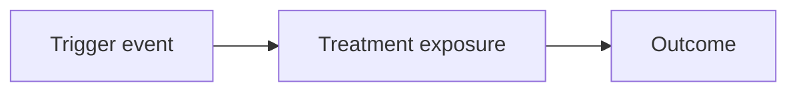
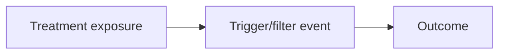

# Triggered Analysis and Noncompliance

Randomization assigns users to an experiment. It does not guarantee that they experience the treatment.

A user may be assigned to a checkout experiment but never reach checkout. A user may be assigned to a recommendation experiment but never open the feed. A user may be assigned to a one-click apply experiment but not have a saved resume. A user may be assigned to a coupon experiment but never see the coupon.

This creates one of the most common interpretation problems in A/B testing:

> Should the experiment analyze everyone assigned, or only users who actually experienced the feature?

The answer depends on the question.

This chapter explains assignment, exposure, triggered analysis, intent-to-treat, treatment-on-treated, noncompliance, and why filtering on post-treatment behavior can be dangerous.

## Assignment Is Not Exposure

Experiment assignment is the random decision made by the experimentation system.

Exposure is the moment a user actually has a chance to be affected by the treatment.

For example, suppose a product tests a new checkout page.

- A user is assigned to treatment when they visit the website.
- The user is exposed only if they reach the checkout page.

If many assigned users never reach checkout, the treatment cannot affect them. Including them in the analysis dilutes the measured effect.

This is not necessarily wrong. It just answers a broader question.

Analyzing all assigned users answers:

> What is the effect of assigning users to this product experience?

Analyzing only users who reach checkout answers:

> What is the effect among users who had a chance to experience the checkout change?

Both questions can be useful. They are not the same question.

## Intent-to-Treat

Intent-to-treat, or ITT, analyzes users according to their assigned group, regardless of whether they actually received the treatment.

The ITT effect is:

$$
\widehat{\tau}_{ITT}
=
\bar{Y}_{Z=1} - \bar{Y}_{Z=0}
$$

where:

- $Z=1$ means assigned to treatment
- $Z=0$ means assigned to control

ITT preserves the benefit of randomization. Because assignment is random, treatment and control groups should be comparable before the experiment.

ITT is often the safest primary analysis because it avoids conditioning on behavior that may have been affected by treatment.

The weakness of ITT is dilution. If only a small share of assigned users are exposed, the ITT effect may be much smaller than the effect among exposed users.

Suppose a one-click apply button increases completed applications by 10% among eligible application-page visitors. But if only 20% of assigned users ever visit an eligible application page, the ITT effect among all assigned users may be around 2%.

The treatment worked where it was shown, but the broad assignment population makes the effect look small.

## Triggered Analysis

Triggered analysis focuses on users who actually triggered the experiment.

A trigger event is the moment a user becomes eligible to experience the treatment. Examples include:

- Landing on the checkout page
- Opening the feed where a ranking model is used
- Viewing a job application page with a saved resume
- Seeing a search results page where a new ranking rule applies
- Entering a city-time block where a marketplace policy is active

A clean triggered analysis defines the trigger before the experiment starts.

For example:

> A user triggers the checkout experiment when they land on checkout.

Then randomization can happen at the trigger point, or the analysis can restrict to users who reached that pre-defined trigger.

Triggered analysis can improve sensitivity because it removes users who could not possibly be affected. It often gives a more product-relevant estimate for feature-level changes.

But triggered analysis is only safe when the trigger is not affected by treatment.

## The Post-Treatment Filtering Problem

Filtering on post-treatment behavior can break randomization.

Suppose a homepage experiment changes the layout and may affect whether users reach checkout. If the analysis keeps only users who reached checkout, it conditions on a behavior that treatment itself influenced.

The treatment group users who reach checkout may not be comparable to the control group users who reach checkout. The filter creates selection bias.

The problem can be summarized as:

> Do not condition on a variable that treatment may have changed.

For example:

- If treatment affects clicks, do not analyze only clickers to estimate the effect on purchases.
- If treatment affects trial starts, do not analyze only trial starters to estimate the effect on paid conversion without care.
- If treatment affects feed visits, do not analyze only feed visitors to estimate the effect on retention.

This does not mean post-treatment analyses are useless. They can help explain mechanisms. But they should not be presented as clean causal effects unless the assumptions are clear.

## Safe and Risky Triggers

Triggers are safer when they happen before treatment can affect behavior.

Consider two checkout experiments.

In the first experiment, the assignment happens when users land on checkout, and treatment changes the checkout page. The trigger is landing on checkout. Since users have not seen the checkout treatment before triggering, analyzing triggered users is usually reasonable.

In the second experiment, the assignment happens on the homepage, and treatment changes homepage recommendations. The analysis then filters to users who reached checkout. This is risky because the homepage treatment may affect who reaches checkout.

The same event, reaching checkout, can be safe or risky depending on where treatment starts.

The timing matters:

This structure is usually safe.

This structure is risky because the filter is downstream of treatment.

## Treatment-on-Treated

Treatment-on-treated, or TOT, tries to estimate the effect among users who actually received treatment.

The simplest intuition is:

$$
\text{TOT} \approx
\frac{\text{ITT effect}}{\text{Exposure rate}}
$$

This approximation is most natural when:

- Some treatment-assigned users are not exposed
- Control users cannot receive treatment
- Assignment affects outcomes only through treatment exposure
- Exposure itself is not hiding other selection problems

For example, suppose:

- Users are randomized at app open
- Only 40% of treatment-assigned users open the feed and see the new ranking model
- Control users never see the new ranking model
- ITT effect on watch time is +2%

Then a rough treatment-on-treated estimate is:

$$
\frac{2\%}{40\%} = 5\%
$$

This says the effect among users who actually saw the new ranking model may be about +5%.

But this estimate depends on assumptions. If users who open the feed are systematically different, or if treatment affects whether users open the feed, the simple ratio can mislead.

## Noncompliance

Noncompliance occurs when assignment and actual treatment received do not match.

Examples include:

- Users assigned to treatment do not see the feature because of a bug
- Users assigned to control see treatment because of cache or cross-device leakage
- A seller assigned to a new policy opts out
- A user assigned to receive a notification has notifications disabled
- A coupon assigned to a user is not redeemed

Let:

- $Z_i$ be assignment
- $D_i$ be actual treatment received
- $Y_i$ be outcome

In a perfect experiment:

$$
D_i = Z_i
$$

With noncompliance, assignment still remains random, but treatment received may not be random.

This is why analyzing by actual treatment received can be biased. Users who actually receive or use the treatment may differ from users who do not.

For example, coupon redemption is not random. Users who redeem coupons may be more price-sensitive or more purchase-intent than users who ignore them. Comparing redeemers to non-redeemers does not estimate the causal effect of coupons.

## Instrumental Variables and Complier Effects

Random assignment can sometimes be used as an instrument for actual treatment received.

The idea is:

> Assignment is random, and assignment changes the probability of receiving treatment.

Under certain assumptions, the experiment can estimate the causal effect for compliers: users whose treatment received changes because of assignment.

This is often called the complier average causal effect, or CACE. It is closely related to treatment-on-treated in one-sided noncompliance settings.

The Wald estimator is:

$$
\widehat{\tau}_{CACE}
=
\frac{\bar{Y}_{Z=1} - \bar{Y}_{Z=0}}
{\bar{D}_{Z=1} - \bar{D}_{Z=0}}
$$

The numerator is the ITT effect on the outcome. The denominator is the ITT effect on treatment received.

For example:

- 60% of treatment-assigned users see a feature
- 10% of control-assigned users also see it because of leakage
- Treatment assignment increases exposure by 50 percentage points
- The ITT effect on the outcome is +1.5 percentage points

Then:

$$
\widehat{\tau}_{CACE}
=
\frac{1.5}{50}
=
3\text{ percentage points}
$$

The estimated effect among compliers is 3 percentage points.

This estimate requires assumptions:

- Assignment is random
- Assignment affects the outcome only through treatment received
- Assignment increases treatment received in a consistent direction
- There is no interference between units

These assumptions are not automatic. They should be argued from the product design.

## One-Sided and Two-Sided Noncompliance

Noncompliance can be one-sided or two-sided.

In one-sided noncompliance, only treatment users can fail to receive treatment. Control users cannot receive treatment.

Example:

- Treatment users are eligible for a new onboarding module
- Some never reach the module
- Control users never see the module

In this case:

$$
\bar{D}_{Z=0} = 0
$$

and the CACE denominator becomes the treatment exposure rate.

In two-sided noncompliance, both sides can mismatch assignment.

Example:

- Some treatment users do not see the feature because of a bug
- Some control users see the feature because of cache leakage

Two-sided noncompliance is harder because the experiment has contamination in both directions. The ITT estimate may still be valid for assignment, but estimating the effect of actual treatment requires stronger assumptions.

## Exposure Rate and Dilution

Low exposure rates dilute ITT estimates.

Suppose a feature has a true effect of +10% among exposed users.

If only 10% of assigned users are exposed, the ITT effect may be roughly:

$$
10\% \times 10\% = 1\%
$$

If 50% are exposed, the ITT effect may be roughly:

$$
10\% \times 50\% = 5\%
$$

This matters for power.

An experiment randomized too broadly may need much more sample size to detect the diluted ITT effect. Triggering the experiment closer to the actual exposure point can increase sensitivity.

But triggering closer to exposure is safe only if the trigger is not affected by treatment.

## Product Example: One-Click Apply

Suppose a job platform tests a one-click apply button.

The feature allows job seekers to submit an application using a saved resume and profile. The product goal is to increase completed applications without reducing application quality.

There are several possible analysis populations.

**All assigned users**

Users are randomized when they visit the job platform. This gives an ITT estimate for the broad product assignment. But many users may never visit an application page, so the effect will be diluted.

**Eligible application-page visitors**

Users trigger the experiment when they view an application page and have a saved resume/profile. This is often the cleanest population for estimating the effect of the feature.

**Users who clicked apply**

This is risky if the treatment changes click behavior. One-click apply may make applying easier and change who clicks. Comparing only clickers can condition on a post-treatment action.

Primary metric:

- Completed applications per eligible application-page visitor

Secondary metrics:

- Apply button click rate
- Form completion time
- Application submission errors
- Application withdrawal rate

Guardrails:

- Recruiter response rate
- Interview invitation rate
- Duplicate applications
- Recruiter complaints
- User support contacts

The clean design is to define the trigger before exposure:

> The experiment triggers when an eligible user lands on an application page.

Then the analysis can compare treatment and control among triggered users without filtering on a behavior caused by treatment.

## Product Example: Coupon Redemption

Now consider an e-commerce app testing a discount coupon.

Treatment users receive a coupon banner. Control users do not.

A tempting analysis is:

> Compare users who redeemed the coupon with users who did not redeem it.

This is not a valid A/B test comparison. Coupon redeemers are likely different from non-redeemers. They may have higher purchase intent, lower price tolerance, or stronger category interest.

The randomized comparison is:

> Compare users assigned to receive the coupon with users assigned not to receive it.

This estimates the ITT effect of coupon assignment.

If the team wants the effect among users whose purchase behavior changed because they received the coupon, assignment can be used as an instrument for coupon redemption under additional assumptions. But the simple redeemer-versus-non-redeemer comparison should not be treated as causal.

This example is important because product teams often care about feature usage. But users who choose to use a feature are rarely comparable to users who do not.

## Practical Workflow

A practical workflow for triggered analysis and noncompliance is:

1. Define the randomization point.
2. Define the first moment a user can be affected by treatment.
3. Decide whether the primary estimand is ITT, triggered effect, or complier effect.
4. Define trigger events before launch.
5. Avoid filtering on post-treatment behavior for the primary causal estimate.
6. Track exposure and treatment receipt separately from assignment.
7. Report exposure rates by treatment group.
8. If noncompliance exists, report ITT first and use CACE/TOT only with clear assumptions.
9. Use post-treatment funnel cuts as diagnostics, not as the main causal result.

## Common Mistakes

**Analyzing only users who used the feature**

Feature users are usually selected. They may be more engaged, more motivated, or more likely to convert even without treatment.

**Filtering to a downstream funnel step affected by treatment**

If treatment changes who reaches the step, the filtered groups are no longer randomized comparisons.

**Calling triggered analysis ITT**

Triggered analysis can be valid, but it answers a different question from the broad assignment effect.

**Ignoring exposure rate**

A small ITT effect may hide a large effect among exposed users if exposure is rare.

**Using treatment-on-treated without assumptions**

TOT and CACE require assumptions about how assignment affects treatment receipt and outcomes.

## Key Takeaways

Assignment is not the same as exposure.

Intent-to-treat analyzes users by assignment and preserves randomization.

Triggered analysis focuses on users who had a chance to experience treatment.

Triggered analysis is safest when the trigger occurs before treatment can affect behavior.

Filtering on post-treatment behavior can create selection bias.

Treatment-on-treated estimates the effect among users who received treatment, but it requires stronger assumptions.

Noncompliance means assignment and treatment received do not match.

Random assignment can sometimes be used as an instrument to estimate complier effects.

Report assignment, exposure, and outcome clearly. Most confusion comes from mixing them together.
