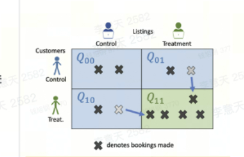

# Interference and Network Effects

Most A/B tests rely on a quiet assumption:

> One user's treatment assignment does not affect another user's outcome.

This assumption is often called no interference. In causal inference, it is part of the stable unit treatment value assumption, or SUTVA.

Many product experiments satisfy this assumption well enough. If a user sees a different button color, that usually does not affect another user's conversion. If a user receives a new onboarding checklist, that usually does not change another user's experience.

But in marketplaces, social networks, ranking systems, auctions, logistics systems, and creator ecosystems, users interact through shared resources. One user's treatment can change what another user sees, how much supply is available, or how the platform allocates attention.

When this happens, a simple user-level A/B test can become hard to interpret.

This chapter explains interference, spillover, network effects, switchback experiments, geo experiments, cluster randomization, and practical ways to diagnose whether spillover may be happening.

The chapter moves in four steps:

1. Define interference, spillover, and treatment saturation.
2. Identify the channels through which interference travels.
3. Diagnose whether spillover may be contaminating a user-level experiment.
4. Choose a design and inference method that matches the interference structure.

## What Is Interference?

Interference occurs when one unit's treatment affects another unit's outcome.

In a standard user-level A/B test, the outcome for user \(i\) is usually written as:

$$
Y_i(T_i)
$$

This notation says user \(i\)'s outcome depends only on their own treatment assignment \(T_i\).

With interference, the outcome may depend on many users' assignments:

$$
Y_i(T_1, T_2, \ldots, T_n)
$$

This makes the comparison more complicated. A control user in a treated environment may not represent the outcome that would have happened in a fully untreated world.

The control group is no longer pure control.

## Direct Effects, Spillovers, and Saturation

With interference, it helps to separate three related ideas.

**Direct effect**

The effect of receiving treatment, holding the surrounding environment fixed.

**Spillover effect**

The effect of being in an environment where other units receive treatment.

For a control user, the direct effect is zero because they did not receive treatment. But the spillover effect may be nonzero if nearby treatment users affect shared resources.

**Treatment saturation**

The share of relevant nearby units assigned to treatment.

A useful way to think about the outcome is:

$$
Y_i = f(\text{own treatment}, \text{treatment saturation around }i)
$$

"Nearby" depends on the product:

- Same city-hour in food delivery
- Same auction market in ads
- Same social graph neighborhood in social networks
- Same category or seller pool in e-commerce
- Same creator audience cluster in content platforms

If outcomes change with local treatment saturation, interference is likely.

## Interference Channels

Interference is the broad problem: one unit's outcome depends on other units' treatment assignments. Spillover is one specific way interference appears:

> Treated units indirectly affect untreated or control units.

Not all interference is described from the control user's perspective. Treatment users can also affect other treatment users. For example, if many treated food-delivery users place more orders at the same time, treated users may create congestion for other treated users. That is interference. When that congestion affects control users, it is spillover.

Interference usually travels through a specific channel. Understanding the channel helps decide whether a user-level test is safe and what alternative design may be needed.

### Social Exposure

In social products, treated users can directly expose control users to treatment-driven behavior.

Examples:

- A treated user shares more content, and control friends see it.
- A treated user sends more invitations or messages.
- A treated creator posts more, and control followers consume more.
- A treated group admin changes group activity, affecting control members.

The shared resource is the social graph. The treatment changes what flows through that graph.

### Limited Supply

Treatment users may consume scarce supply, making less of it available to control users.

Examples:

- Treated Airbnb guests book listings, reducing listing availability for control guests.
- Treated ride-sharing users request more rides, occupying nearby drivers and increasing wait time for control riders.
- Treated food-delivery users place more orders, using courier and restaurant capacity.
- Treated e-commerce buyers purchase limited inventory, causing stockouts for control buyers.

The shared resource is supply: listings, drivers, couriers, restaurants, inventory, or service capacity.

### Limited Demand or Attention

Treatment supply-side units may attract scarce demand or attention away from control supply-side units.

Examples:

- Treated Airbnb listings receive more bookings, leaving fewer bookings for control listings.
- Treated sellers receive more impressions or orders, reducing demand for control sellers.
- Treated creators receive more feed exposure, pushing control creators lower.
- Treated ads win more ad slots, reducing impressions for control ads.

The shared resource is demand or attention: buyers, impressions, feed positions, bookings, or ad slots.

Ranking, search, recommendation, auction, and dispatch systems often transmit this kind of interference. They are not always separate root causes. They are platform mechanisms for allocating scarce demand, supply, or attention.

### Congestion and Capacity

Treatment may increase total load on a shared operational system.

Examples:

- More orders create restaurant preparation delays.
- More ride requests increase driver utilization.
- More support contacts slow customer support response time.
- A compute-heavy ranking model increases latency for everyone.

Congestion is closely related to limited supply, but it is useful to name separately because the harmed unit may not be competing for a specific item. The whole system becomes slower or more crowded.

### Pricing and Market Equilibrium

Treatment may change prices, bids, or incentives, which then affects other units.

Examples:

- A rider promotion increases demand and triggers surge pricing for control riders.
- An advertiser bidding tool raises auction prices for control advertisers.
- Seller subsidies change market prices and reduce control sellers' competitiveness.
- A dynamic-pricing policy changes buyer expectations across the market.

The shared object is the market equilibrium: prices, bids, incentives, and supply-demand balance.

### Learning and Ecosystem Feedback

Treatment can change future behavior in ways that affect the environment for everyone.

Examples:

- Treated sellers learn better pricing strategies and compete differently later.
- Treated creators receive more traffic and produce more content in the future.
- Treated drivers learn incentive patterns and change where or when they work.
- Treated users learn about a feature and tell control users outside the product.

These effects may be delayed. They are especially important for long-running experiments and ecosystem changes.

### Cross-Device or Cross-Account Contamination

Sometimes the same real-world person or organization appears in both treatment and control.

Examples:

- A user is assigned to treatment on mobile but control on desktop.
- Family members share an account or device.
- A seller operates multiple accounts assigned to different arms.
- A company account has multiple employees seeing different variants.

This is often called contamination rather than interference, but the practical problem is similar: treatment and control are no longer cleanly separated.

The categories can be summarized as:

| Channel | Shared Resource or Path | Example |
|---|---|---|
| Social exposure | Friends, followers, messages | Treated users share content to control users |
| Limited supply | Listings, drivers, inventory | Treated guests book scarce listings |
| Limited demand or attention | Buyers, impressions, feed positions | Treated listings pull demand from control listings |
| Congestion and capacity | Operational throughput | More orders slow restaurants or couriers |
| Pricing and equilibrium | Prices, bids, incentives | Promotions trigger surge pricing |
| Learning and feedback | Future behavior or supply | Treated creators produce more content later |
| Contamination | Identity or account boundary | Same person sees both variants |

In all of these cases, the treatment effect is not confined to treated units.

## A First Spillover Example

For example, suppose a food delivery app tests showing delivery time as a range instead of a point estimate:

- Control users see "30 minutes"
- Treatment users see "25-35 minutes"

At first, this looks like a simple UI experiment. But if the treatment changes order volume or cancellation behavior, it may affect shared operational capacity.

Treatment users may:

- Place more or fewer orders
- Cancel less often
- Contact support less often
- Change when they order

Those behaviors can affect:

- Restaurant workload
- Courier availability
- Delivery time
- Support queue length
- Experience for control users in the same city and time period

The result is spillover. Control users are no longer experiencing the world that would have existed without treatment.

## Why User-Level Randomization Can Fail

User-level randomization is attractive because it creates many independent units and usually gives high statistical power.

But if users share resources, user-level randomization can mix treatment and control inside the same system.

In a marketplace, treatment users and control users may compete for the same:

- Drivers
- Restaurants
- Sellers
- Inventory
- Ad slots
- Feed positions
- Creator attention
- Customer support capacity

When this happens, the user-level treatment effect may be biased toward zero or may estimate the wrong effect entirely.

For example, if a food delivery treatment increases demand, both treatment and control users may experience slower delivery in the experiment market. A user-level treatment-control comparison may subtract out this shared congestion and estimate something closer to the direct effect of the UI among users in a partially treated system. But a full rollout changes the whole system: if all users receive treatment, demand, courier utilization, restaurant load, and delivery time may shift again.

In that case, the user-level experiment is not necessarily "biased" for the direct effect at the tested saturation level. The problem is that the direct effect may not equal the total effect of full rollout.

The measured effect depends on the treatment saturation in the environment.

## Diagnosing Spillover

Detecting spillover is hard because the counterfactual is missing. In a user-level experiment, the control group may already be contaminated by treatment users.

A common first idea is:

> Run a user-level experiment and check whether metrics in the control group significantly decrease.

This can be a useful smoke test, but it is not proof.

Control metrics can move for many reasons:

- Weather
- Holidays
- Marketing campaigns
- Supply shocks
- Logging changes
- Seasonality
- Product outages

Also, if every market has the same treatment share, there may be no uncontaminated comparison group. Control users may be affected everywhere.

Better diagnostics compare control outcomes across different levels of treatment exposure. The methods in this part are mainly about detecting whether spillover exists. When the design creates randomized variation in exposure, they can also estimate the size of the spillover more credibly.

### Operational Mediators

When spillover is plausible, it helps to track operational mediators.

Mediators are metrics that explain how treatment could affect other units. They do not prove interference by themselves, but they make the mechanism visible.

For food delivery:

- Courier utilization
- Restaurant preparation delay
- Delivery time
- Order backlog
- Cancellation queue
- Support volume by city-hour

For ride-sharing:

- Driver utilization
- Rider wait time
- Surge price frequency
- Driver acceptance rate
- Ride cancellation rate

For ads:

- Auction density
- Average bid
- Cost per impression
- Win rate
- Budget exhaustion

For creator platforms:

- Exposure concentration
- Creator traffic distribution
- Creator posting frequency
- Content supply
- Cold-start creator impressions

If treatment changes these shared mediators, spillover becomes more plausible. They also help identify the right randomization block. For example, if courier utilization moves at the city-hour level, then city-hour may be a better experimental unit than individual users.

### Treatment Saturation Analysis

If spillover exists, control users in high-treatment environments should be affected more than control users in low-treatment environments.

For food delivery, the analysis might define treatment saturation by city-hour:

$$
\text{Treatment Saturation}_{g,t}
=
\frac{\text{Treatment users in city }g\text{ at hour }t}
{\text{All experiment users in city }g\text{ at hour }t}
$$

Then the team can ask:

> Among control users, do delivery time, cancellation rate, or complaint rate change more in city-hour blocks with higher treatment saturation?

A simple diagnostic regression might be:

$$
Y_{i,g,t}
=
\alpha
+ \beta \text{Treatment}_i
+ \gamma \text{Saturation}_{g,t}
+ \epsilon_{i,g,t}
$$

For control users only, the direct treatment term drops out, and the focus is:

$$
Y_{i,g,t}
=
\alpha
+ \gamma \text{Saturation}_{g,t}
+ \epsilon_{i,g,t}
$$

If \(\gamma\) is meaningfully different from zero, that suggests control outcomes vary with nearby treatment intensity.

This is still diagnostic, not definitive. High-saturation city-hours may differ from low-saturation city-hours in other ways. But it is stronger than simply checking whether the overall control group moved.

Treatment saturation analysis and two-stage randomization are closely related. Treatment saturation is the quantity being studied: how treated is the local environment? Two-stage randomization is a design that deliberately creates randomized variation in that quantity.

### Two-Stage Randomization

Two-stage randomization is a design built to estimate both direct and spillover effects.

In the first stage, clusters are randomized to different treatment saturation levels:

- Some markets: 0% treatment
- Some markets: 25% treatment
- Some markets: 50% treatment
- Some markets: 75% treatment
- Some markets: 100% treatment

In the second stage, users within each market are randomized according to the assigned saturation level.

This design lets the team estimate:

- The direct effect of being treated
- The spillover effect of being surrounded by more treated users
- How the total effect changes as treatment scales

For example, if control users have worse delivery times in 75% treatment markets than in 25% treatment markets, the platform has evidence of congestion spillover.

Two-stage randomization is powerful conceptually, but it requires enough clusters and careful operational control. It is usually more complex than a standard A/B test.

The difference from ordinary saturation analysis is that the saturation levels are randomized. That makes comparisons across saturation levels more credible. Instead of relying on natural variation in city-hour treatment share, the experiment intentionally assigns some markets to low saturation and others to high saturation.

In short:

- Treatment saturation analysis is the analysis lens.
- Two-stage randomization is the cleaner design for creating saturation variation.
- Without randomized saturation, saturation analysis is mainly diagnostic.
- With randomized saturation, it can estimate spillover effects more causally.

### Geo Holdouts

A stronger design is to keep some clusters fully untreated.

For example, a food delivery platform might divide markets into:

- Fully untreated holdout cities
- Experiment cities with user-level treatment/control randomization

This allows two useful comparisons:

1. Treatment users versus control users inside experiment cities
2. Control users inside experiment cities versus users in fully untreated holdout cities

If control users inside experiment cities differ from users in fully untreated holdout cities, that is evidence that the experiment environment itself changed.

Geo holdouts are useful when spillovers are mostly contained within geographic markets. They are less useful if users or supply frequently cross geographic boundaries.

The main challenge is power. Geo experiments often have far fewer units than user-level experiments, so they require careful design, matching, blocking, or longer duration.

## Designing Experiments Under Interference

Once spillover is likely, the experiment design may need to change. The methods in this part are less about diagnosing spillover after the fact and more about estimating treatment effects in a way that avoids, contains, or explicitly accounts for spillover.

The goal is not always to eliminate interference completely. In many marketplace and network settings, that is impossible. The goal is to choose a design whose estimate matches the decision: a direct effect, a market-level effect, a full-rollout effect, or an effect under a specific saturation level.

### Block-Based Designs

Cluster, graph-cluster, geo, and switchback experiments are closely related. They all move randomization away from individual users and toward larger blocks.

The main difference is how the blocks are defined.

| Design | What Gets Randomized? | How Blocks Are Defined | Main Design Challenge |
|---|---|---|---|
| Cluster experiment | Groups | Schools, stores, sellers, creators, user communities | Choosing clusters that contain most interference |
| Graph-cluster experiment | Network communities | Groups of connected users in a social graph | Reducing cross-cluster edges without losing too much power |
| Geo experiment | Geographic markets | Cities, regions, DMAs, store catchments | Finding comparable markets and avoiding cross-border spillover |
| Switchback experiment | Market-time or system-time blocks | City-hour, region-30-minute window, product-day | Choosing time-window length and handling carryover |

This shared structure is useful:

> Instead of asking, "Which users should receive treatment?", these designs ask, "What larger block should move together?"

For geo experiments, the block size is often naturally given by the business: city, region, store catchment, or advertising market. The design work is mainly about selecting comparable geos, matching or blocking them, and checking whether spillover across geos is small enough.

For switchback experiments, the block is created by the experimenter. The team must choose the time-window length and switching frequency. Short windows create more randomized blocks and usually more power, but they increase the risk that treatment in one window affects the next window. Long windows reduce carryover risk, but they create fewer randomized blocks and can make the experiment slower.

This is why carryover is central in switchback experiments. A dispatch algorithm, price change, courier incentive, or ranking policy may change system state after the treatment window ends. The following control window may not be a clean control anymore.

Carryover is usually less central in geo experiments because different cities or regions are often assumed to be mostly independent at the same point in time. But it is still an assumption, not a guarantee. Geo experiments can have spillover if users travel across cities, drivers serve multiple regions, advertising markets overlap, sellers operate nationally, or information spreads from treated geos to control geos.

So the family resemblance is:

- All of these designs randomize blocks instead of individual users.
- The observation unit can still be user, order, session, ride, delivery, or listing view.
- The effective sample size depends on the number and quality of randomized blocks.
- The key design question is whether the chosen blocks contain the interference that would otherwise contaminate the experiment.

### Randomization Unit Versus Observation Unit

In cluster, geo, and switchback experiments, the randomization unit is usually not the individual user.

If a geo experiment randomizes cities, the randomization unit is the city. All users, sessions, or orders in that city receive the city's assignment. If a switchback experiment randomizes city-hour blocks, the randomization unit is the city-hour block. All activity inside that market-time window receives the same assignment.

The observation unit can still be much smaller:

- User
- Session
- Order
- Listing view
- Delivery
- Ride request

For example, in a city-level geo experiment:

$$
Y_{i,g} = \alpha + \tau T_g + \epsilon_{i,g}
$$

where \(i\) indexes users or orders, \(g\) indexes cities, and \(T_g\) is the city-level treatment assignment.

In a switchback experiment:

$$
Y_{i,g,t} = \alpha + \tau T_{g,t} + \epsilon_{i,g,t}
$$

where \(T_{g,t}\) is the treatment assignment for city \(g\) during time window \(t\).

The raw dataset may contain millions of user or order rows. But treatment variation comes from the randomized clusters or market-time windows. The analysis must respect that assignment level, often by clustering standard errors, aggregating outcomes to the randomized unit, or using randomization inference.

This is why people often say cluster or switchback designs "reduce sample size." More precisely, they reduce the effective sample size, not necessarily the raw number of observations.

If a switchback experiment observes one million deliveries, those deliveries are still in the dataset. But if treatment is randomized across 200 region-time blocks, the experiment has 200 independent treatment assignments, not one million. Deliveries inside the same region-time block share the same treatment, weather, demand level, courier supply, restaurant load, and other local shocks.

A common design-effect approximation is:

$$
\text{Design Effect} = 1 + (m - 1)\rho
$$

where:

- \(m\) is the average number of observations per randomized cluster
- \(\rho\) is the intra-cluster correlation

The effective sample size is roughly:

$$
n_{\text{eff}} =
\frac{n}{1 + (m - 1)\rho}
$$

If \(\rho = 0\), clustering does little harm. But if outcomes inside the same cluster or time block are correlated, the effective sample size can be much smaller than the raw observation count.

For example, suppose:

- Raw observations: 1,000,000 deliveries
- Average cluster size: 1,000 deliveries
- Intra-cluster correlation: 0.01

Then:

$$
\text{Design Effect} = 1 + 999 \times 0.01 = 10.99
$$

and:

$$
n_{\text{eff}} \approx \frac{1{,}000{,}000}{10.99} \approx 91{,}000
$$

The experiment still observes one million deliveries, but its precision behaves more like an individually randomized experiment with about 91,000 independent observations.

The key distinction is:

- Randomization unit: where treatment is assigned
- Observation unit: where outcomes are measured
- Inference unit: the level that determines independent treatment variation

### Inference in Block-Based Designs

Block-based designs require special care during inference because the raw data can be misleadingly large.

Suppose a switchback experiment contains one million deliveries. If treatment was randomized across 200 region-time windows, the experiment does not have one million independent treatment assignments. It has 200 randomized blocks. The deliveries inside the same block share treatment, weather, demand, courier supply, restaurant congestion, and local operational shocks.

The most important rule is:

> Analyze uncertainty at the level where treatment was randomized.

This does not mean every analysis must collapse the dataset to 200 rows. Individual orders, users, or sessions can still be used as observations. But the standard errors, confidence intervals, and hypothesis tests must respect the block-level assignment.

There are several common approaches.

**Aggregate to the randomized block**

The simplest approach is to compute one outcome per randomized block, then compare treated and control blocks.

For example, in a city-hour switchback experiment, compute:

$$
\bar Y_{g,t}
=
\text{average delivery time in city }g\text{ during time window }t
$$

Then estimate the treatment effect using the city-hour block as the analysis row:

$$
\bar Y_{g,t}
=
\alpha
+ \tau T_{g,t}
+ \epsilon_{g,t}
$$

This approach is easy to explain and naturally respects the assignment level. The downside is that it may throw away useful lower-level information, especially when blocks have very different sizes.

**Use individual-level data with clustered standard errors**

Another approach keeps the lower-level observations but clusters standard errors at the randomization level:

$$
Y_{i,g,t}
=
\alpha
+ \tau T_{g,t}
+ \epsilon_{i,g,t}
$$

Here, \(i\) might be a delivery, order, user, or session. The treatment varies at the \(g,t\) block level, so the standard errors should allow observations inside the same block to be correlated.

For a geo experiment randomized by city, cluster at the city level. For a switchback experiment randomized by city-hour, the first instinct may be to cluster at the city-hour level, but this is not always enough. If outcomes are correlated across adjacent time windows within the same city, the analysis may need city-level clustering, two-way clustering, time-series-aware standard errors, or randomization-based inference.

**Use randomization inference**

Randomization inference uses the actual experimental design to calculate uncertainty. Instead of relying on large-sample approximations, it asks:

> If there were no treatment effect, how often would this randomization design produce an effect estimate as large as the one we observed?

The procedure is:

1. Keep the observed outcomes fixed.
2. Reassign treatment many times using the same randomization scheme used in the experiment.
3. Recalculate the treatment effect each time.
4. Compare the observed estimate with this randomization distribution.

This is especially useful when the number of blocks is small, such as geo experiments with a limited number of cities.

**Handle small numbers of blocks carefully**

Many block-based experiments have few independent units. This is common in geo experiments and graph-cluster experiments.

When the number of randomized blocks is small, ordinary regression standard errors can be too optimistic. Better options include:

- Matched-pair analysis when markets were paired before randomization
- Randomization inference
- Wild cluster bootstrap
- Synthetic-control or difference-in-differences style adjustment for geo experiments
- Conservative reporting that emphasizes effect size and uncertainty, not only p-values

The analysis should also preserve the design. If cities were matched before randomization, estimate within-pair differences rather than ignoring the matched structure.

**Choose the weighting deliberately**

Blocks can be very different in size.

An equal-weighted analysis answers:

> What is the average effect across blocks?

A traffic-weighted analysis answers:

> What is the average effect across users, orders, sessions, or revenue?

Neither is automatically correct. A city-weighted geo experiment may be appropriate if the business wants to know whether the treatment works across markets. A traffic-weighted analysis may be appropriate if the business wants the expected total user impact after launch.

The book's practical recommendation is simple: state the weighting choice explicitly, because it defines the estimand.

**Add controls without breaking the design**

Regression adjustment can improve precision in block-based experiments, especially when blocks differ in baseline volume or seasonality.

Common controls include:

- Pre-period outcome values
- City fixed effects
- Hour-of-day fixed effects
- Day-of-week fixed effects
- Matched-pair indicators
- Baseline demand or supply measures

These controls should adjust for predictable variation, not redefine who is considered treated. The treatment assignment should still be analyzed according to the original randomized design.

For switchback experiments, time controls are especially important. Treatment and control periods should be balanced across lunch, dinner, weekdays, weekends, holidays, and other recurring patterns. The analysis should also consider serial correlation and carryover between adjacent windows.

The practical inference checklist is:

- Identify the randomized block.
- Decide whether the estimand is block-weighted or traffic-weighted.
- Use standard errors or randomization inference that respect the assignment level.
- Preserve matching, blocking, or stratification from the design.
- For switchbacks, handle time patterns, serial correlation, and carryover.
- For geo experiments, check whether cross-geo spillover is plausible.

### Cluster Randomization

Cluster randomization assigns whole groups to treatment or control.

Examples:

- Randomize cities
- Randomize schools
- Randomize stores
- Randomize creators
- Randomize sellers
- Randomize social graph clusters
- Randomize time blocks

The goal is to keep interference mostly inside the cluster rather than across treatment and control units.

If a food delivery experiment randomizes whole cities, treatment users and control users do not compete inside the same city. This reduces spillover between experiment arms.

The tradeoff is statistical power. Cluster randomization has fewer independent units. A city-level experiment with 20 cities has 20 randomized units, not millions of users.

The analysis should reflect the cluster-level design. Standard errors often need to be clustered at the randomization level, and the effective sample size is closer to the number of clusters than the number of users.

### Graph Cluster Randomization

In social networks, clusters are less obvious.

Cities, schools, and stores are explicit clusters. A social graph is different. Users are connected through friendships, follows, messages, groups, and content sharing. There may be one giant connected component, so it is impossible to create perfectly isolated clusters.

Suppose a social platform tests a new sharing feature. If a treated user shares more posts, control friends may see more content even though they were not assigned to treatment. This creates spillover through edges in the social graph.

A practical approach is graph cluster randomization:

1. Build a graph where nodes are users and edges represent likely spillover paths, such as friendships, follows, messages, or feed exposure.
2. Partition the graph into clusters using a community detection or graph partitioning algorithm.
3. Try to place users with many connections to each other in the same cluster.
4. Randomize clusters, not individual users.
5. Analyze outcomes with standard errors clustered at the graph-cluster level.

The goal is not to remove every cross-cluster edge. That is usually impossible. The goal is to reduce the number or strength of edges crossing treatment and control.

There are several practical variants:

- Community-based clustering, where densely connected groups are assigned together
- Ego-cluster randomization, where a focal user and some nearby neighbors are assigned as a unit
- Two-stage graph designs, where clusters receive different treatment saturation levels
- Exposure modeling, where the analysis measures both a user's own treatment and the share of treated neighbors

For a social network, the outcome may depend on both:

$$
Y_i =
f(\text{own treatment}, \text{share of treated neighbors})
$$

This makes it possible to estimate whether users are affected by their own treatment, by their friends' treatment, or by both.

Graph cluster randomization has tradeoffs. Larger clusters reduce cross-cluster spillover because more connected users are assigned together. But for a fixed population, larger clusters also mean fewer independent treatment assignments, and outcomes within a cluster may be correlated. Even when users remain the observation unit, the effective sample size can be much smaller than the number of users. Smaller clusters usually improve statistical power but allow more cross-cluster contamination. The design balances spillover reduction against precision.

### Geo Experiments

Geo experiments are cluster experiments where the clusters are geographic areas.

They are common when treatment affects shared local systems:

- Food delivery
- Ride-sharing
- Local services
- Advertising markets
- Retail stores
- Logistics networks

A clean geo experiment requires careful market selection.

Good geo clusters should be:

- Large enough to measure outcomes
- Stable over time
- Similar enough for comparison
- Mostly independent from each other
- Not heavily affected by cross-border user behavior

Often, markets are matched or blocked using pre-period metrics:

- Historical order volume
- Baseline conversion rate
- Average delivery time
- Growth trend
- Seasonality pattern
- Supply-demand balance

Then one market in each matched pair is assigned to treatment and the other to control.

Geo experiments are less precise than user-level tests, but they can estimate effects that user-level tests cannot.

### Switchback Experiments

A switchback experiment randomizes time periods instead of users.

More precisely, it randomizes a whole system, or a local part of the system, across time. For example, a food delivery platform might assign an entire city to:

- Treatment on Monday lunch
- Control on Monday dinner
- Treatment on Tuesday lunch
- Control on Tuesday dinner

The whole marketplace switches together.

Switchback designs are useful when:

- Treatment affects shared capacity
- Effects are short-lived
- The system can switch safely
- Time periods can be compared after controlling for time patterns

Examples include:

- Courier dispatch algorithms
- Delivery fee policies
- Restaurant batching logic
- Surge pricing rules
- Ranking policies in local marketplaces

The main advantage is that treatment and control are not mixed inside the same market-time block.

The main design question is:

> How should the platform divide time into switchback units?

Several factors matter.

**Randomization unit**

The randomized unit is usually a market-time block, product-time block, or system-time block.

Examples:

- City-hour
- Region-30-minute window
- Restaurant-zone lunch period
- Product-day
- Store-week

The observation unit can still be an order, delivery, session, or product view. But treatment assignment happens at the time-block level.

**Switching frequency**

Switching too frequently can create contamination if the effect of one period carries into the next. Switching too slowly creates fewer randomized units and lowers power.

This creates a core tradeoff:

> Short intervals give more randomized units, but more carryover risk. Long intervals reduce carryover risk, but give fewer randomized units.

DoorDash describes this tradeoff in its dispatch experiments: very small region-time buckets can create bias because treatment deliveries and control deliveries still interact through the same marketplace state, while very large buckets increase the margin of error and slow learning. DoorDash reports using region-time units, often around city-level regions and 30-minute switchback periods, for many dispatch experiments. See ["Switchback Tests and Randomized Experimentation Under Network Effects at DoorDash"](https://careersatdoordash.com/blog/switchback-tests-and-randomized-experimentation-under-network-effects-at-doordash/).

**Carryover and washout**

If treatment in one time block affects outcomes in the next time block, then the control period may still be contaminated. For example, a courier incentive in the morning could affect courier supply in the afternoon.

This is called carryover. It is one of the central problems in switchback design.

Possible responses include:

- Use longer treatment/control blocks
- Add washout or blackout periods after switching
- Analyze only later parts of each block
- Choose treatments whose effects decay quickly
- Estimate carryover using historical experiments or pilot tests

Amazon's pricing experiments provide a useful example. In pricing, the same product usually should not show different prices to different customers at the same time. That makes user-level randomization difficult. A switchback or crossover design can randomize the same product across time. But if a treatment increases a product's sales, recommendation systems may continue promoting that product during later control periods. Amazon discusses using blackout periods to let carryover effects decay before analyzing the next phase. See ["The Science of Price Experiments in the Amazon Store"](https://www.amazon.science/blog/the-science-of-price-experiments-in-the-amazon-store).

**Treatment probability**

Many switchback designs use a balanced 50/50 treatment-control assignment across time blocks. This is usually a good default because it balances information across treatment and control.

The paper ["Design and Analysis of Switchback Experiments"](https://arxiv.org/pdf/2009.00148) studies this formally and shows that balanced assignment is often optimal under its design framework. The practical message is simple:

> Unless there is a strong operational reason not to, make treatment and control appear equally often across comparable time periods.

**Time patterns and periodicity**

Outcomes often have strong time patterns:

- Lunch versus dinner
- Weekday versus weekend
- Morning commute versus evening commute
- Holiday versus ordinary day
- High-demand versus low-demand hours

A switchback design should balance treatment and control across these patterns. If treatment happens mostly during lunch and control happens mostly during dinner, the experiment confounds treatment with time of day.

A good design ensures that treatment and control appear across comparable periods. This may require blocking by day of week and hour of day, or using randomization schedules that balance periodic patterns.

Xiong, Chin, and Taylor's ["Data-Driven Switchback Experiments"](https://papers.ssrn.com/sol3/Delivery.cfm/4626245.pdf?abstractid=4626245&mirid=1) emphasizes that estimation error depends on carryover effects, periodicity, serial correlation, and simultaneous experiments. Their ride-sharing application uses prior data to design future switchback schedules and reports lower mean squared error compared with the platform's previous design.

**Serial correlation**

Adjacent time blocks are usually correlated. A city that is congested at 6:00 p.m. may still be congested at 6:30 p.m. Weather, traffic, local events, and supply-demand imbalance persist over time.

This means a switchback experiment cannot usually treat every order as independent. Analysis should account for correlation within market-time blocks and across nearby time blocks. Common approaches include:

- Aggregating outcomes to the randomized market-time unit
- Clustered or sandwich standard errors
- Time-series-aware standard errors
- Multilevel models for nested data
- Randomization-based inference

DoorDash's follow-up analysis article emphasizes this nested data structure: many deliveries belong to the same region-time unit, and those deliveries are correlated. It discusses unit-level analysis, variance reduction, and multilevel modeling for switchback experiments. See ["Experiment Rigor for Switchback Experiment Analysis"](https://careersatdoordash.com/blog/experiment-rigor-for-switchback-experiment-analysis/).

**Simultaneous experiments and external shocks**

Switchback experiments are vulnerable to other changes happening at the same time:

- Promotions
- Weather
- Holidays
- App outages
- Competing product launches
- Other experiments running on the same market

These shocks can create noise or bias if they align with treatment periods. Randomizing start and end points, balancing schedules across time, and documenting concurrent interventions help reduce this risk.

In short, a switchback experiment is not just "turn treatment on and off." It is a design problem involving time-block length, carryover, periodicity, serial correlation, treatment balance, and operational feasibility.

Applied examples:

| Setting | Why Switchback Helps | Key Design Issue |
|---|---|---|
| DoorDash dispatch | Delivery assignment uses shared Dashers, so delivery-level A/B tests create interference | Region-time randomization and nested-data analysis |
| Amazon pricing | The same product should not show different prices to different customers at the same time | Product-time randomization and blackout periods for carryover |
| Ride-sharing platform design | Drivers and riders interact through shared local supply-demand conditions | Data-driven schedules balancing carryover, periodicity, and serial correlation |

### Two-Sided Randomization

Two-sided randomization is designed for platforms where treatment can affect how the two sides of a marketplace interact.

Consider an Airbnb-like lodging marketplace. There are guests on the demand side and listings on the supply side. Guests search for available listings, decide whether to book, and once a listing is booked, it becomes unavailable to other guests for that time period.

If an experiment randomizes only guests, treated guests and control guests still compete for the same listings. If it randomizes only listings, treated listings and control listings still compete for the same guests. Two-sided randomization instead randomizes both sides of the market.

In this design:

- Guests are assigned to control or treatment
- Listings are assigned to control or treatment
- Each guest-listing interaction falls into one of four cells

|  | Control Listings | Treatment Listings |
|---|---:|---:|
| Control Guests | \(Q_{00}\) | \(Q_{01}\) |
| Treatment Guests | \(Q_{10}\) | \(Q_{11}\) |

The first index refers to the guest side. The second index refers to the listing side.

- \(Q_{00}\): control guests interacting with control listings
- \(Q_{01}\): control guests interacting with treatment listings
- \(Q_{10}\): treatment guests interacting with control listings
- \(Q_{11}\): treatment guests interacting with treatment listings

The fully treated interaction is \(Q_{11}\), where a treated guest interacts with a treated listing. The fully control interaction is \(Q_{00}\), where a control guest interacts with a control listing.

The value of this design is not just that it creates four cells. The value is that the mixed cells reveal displacement.

Suppose the treatment is a discount shown only when a treated guest views a treated listing. The outcome is bookings.

\(Q_{11}\) contains the fully treated interactions. Treated guests see discounted treated listings, so bookings in this cell may increase.

\(Q_{01}\) contains control guests and treated listings. These guests do not see the discount, but the treated listings may become less available because treated guests in \(Q_{11}\) booked them. If bookings in \(Q_{01}\) fall relative to \(Q_{00}\), that suggests treated guests are displacing control guests from treated listings.

\(Q_{10}\) contains treated guests and control listings. These guests may shift their attention toward discounted treated listings, leaving control listings with fewer bookings. If bookings in \(Q_{10}\) fall relative to \(Q_{00}\), that suggests treated listings are pulling demand away from control listings.

This is the core intuition:

> \(Q_{11}\) shows the treated match. \(Q_{01}\) and \(Q_{10}\) show where the bookings may have been displaced from.

Without the mixed cells, the platform may see that treated guests book treated listings more often, but it cannot tell whether those bookings are truly incremental or mostly reallocated from other guests and listings.

In practice, the \(Q\) cells should usually be normalized before comparison, because the four cells may contain different numbers of guest-listing opportunities. If \(a_C\) is the treatment share of guests and \(a_L\) is the treatment share of listings, then the normalized booking rates are conceptually:

$$
r_{00} = \frac{Q_{00}}{(1-a_C)(1-a_L)},\quad
r_{01} = \frac{Q_{01}}{(1-a_C)a_L}
$$

$$
r_{10} = \frac{Q_{10}}{a_C(1-a_L)},\quad
r_{11} = \frac{Q_{11}}{a_Ca_L}
$$

These normalized rates make the mixed-cell comparisons more meaningful. For example:

- \(r_{11} - r_{00}\) shows how the fully treated cell differs from the fully control cell.
- \(r_{01} - r_{00}\) helps reveal what happens to treated listings when they are seen by control guests.
- \(r_{10} - r_{00}\) helps reveal what happens to control listings when they are seen by treated guests.

The exact estimator depends on the treatment, the market balance, and the assumptions the platform is willing to make. The important lesson is that two-sided randomization gives the platform information about both demand-side and supply-side competition, which one-sided randomization cannot fully observe.

Two-sided randomization is useful because it helps measure both demand-side and supply-side competition. It can be especially helpful when the marketplace is highly connected and natural clusters are hard to define.

It is not a magic fix. The estimator still needs to be chosen carefully, and the variance can be higher than a simple user-level experiment. But it gives the platform more information about how treatment changes matching and competition across the two sides of the market.

This discussion is inspired by Johari, Li, Liskovich, and Weintraub's paper, ["Experimental Design in Two-Sided Platforms: An Analysis of Bias"](https://arxiv.org/pdf/2002.05670), which studies customer-side, listing-side, and two-sided randomization in booking marketplaces.

## Choosing Between Experiment Designs

The right design depends on where interference happens.

| Setting | Likely Interference Channel | Better Design |
|---|---|---|
| Button color, copy, simple UI | Minimal | User-level A/B test |
| Checkout page with no supply impact | Minimal to modest | User-level or triggered A/B test |
| Food delivery ETA display | Courier and restaurant capacity | User-level with spillover checks, geo holdout, or switchback |
| Courier dispatch algorithm | Shared courier allocation | Switchback or geo experiment |
| Airbnb-style booking marketplace | Guests and listings competing through bookings | Customer-side, listing-side, or two-sided randomization |
| Ads auction ranking | Auction competition | Advertiser cluster, auction-level design, or market-level design |
| Seller ranking policy | Seller exposure and buyer attention | Seller/category cluster or marketplace-level design |
| Social sharing feature | Friend network exposure | Graph cluster randomization or exposure modeling |

There is no universal best design. The design should match the interference structure.

The central question is:

> Who or what shares the resource affected by treatment?

That shared resource often defines the randomization unit.

## Product Example: Delivery Time Ranges

Suppose a food delivery app tests showing delivery time as a range, such as "25-35 minutes," instead of a point estimate, such as "30 minutes."

At first, user-level randomization seems reasonable. The treatment is a UI display, and the primary goal is expectation-setting.

Primary metric:

- Delivery-time-related complaint rate

Guardrails:

- Order conversion rate
- Checkout completion rate
- Refund or credit request rate
- Support contact rate
- Repeat order rate
- Actual delivery time

But the feature may change ordering and cancellation behavior. If treatment users place more orders or cancel less often, they may increase restaurant load and courier utilization. Control users in the same city may then experience different delivery times.

A simple user-level experiment can still be a useful first test if the expected system impact is small. But the report should include spillover diagnostics:

- Compare control users across high- and low-treatment-saturation city-hours
- Track courier utilization and restaurant preparation delay
- Check whether actual delivery time changes for control users
- Compare experiment markets with fully untreated geo holdouts if available

If these diagnostics suggest meaningful spillover, the next experiment should use a design that matches the marketplace structure, such as a geo experiment or switchback design.

## Product Example: Ranking a Shared Seller Pool

Suppose an e-commerce platform tests a new recommendation ranking model that gives more exposure to sellers with high predicted repeat-purchase value.

If users are randomized, treatment users see the new ranking and control users see the old ranking.

But sellers are shared across both groups. If treatment shifts attention toward a smaller set of high-value sellers, it may affect:

- Inventory availability
- Seller response time
- Pricing
- Seller traffic concentration
- Future content or product supply
- Control users' recommendation quality

The experiment is not only changing treatment users' rankings. It may be changing the seller ecosystem.

Useful guardrails and diagnostics include:

- Seller exposure concentration
- Active seller coverage
- Cold-start seller impressions
- Inventory stockout rate
- Refund and return rate
- Control-group changes by seller exposure pressure

If the treatment is expected to substantially reallocate traffic, seller-level or category-level randomization may be more appropriate than user-level randomization. Another option is a long-term holdout where a subset of markets or traffic remains under the old ranking system to measure ecosystem effects.

## Practical Workflow

A practical workflow for interference-aware experiments is:

1. Identify the resource or network that users share.
2. Decide whether treatment could affect that shared resource.
3. Map the likely spillover path from treatment to other users.
4. If using a user-level experiment, predefine spillover diagnostics.
5. Compare control outcomes across treatment saturation levels.
6. Use randomized saturation or geo holdouts if the goal is to estimate spillover more credibly.
7. Track operational mediators that could transmit spillover.
8. If spillover is likely to affect the launch estimate, choose a design that contains or accounts for it, such as cluster randomization, graph clusters, geo experiments, switchbacks, or two-sided randomization.
9. Analyze standard errors at the correct randomization or cluster level.
10. Report whether the estimate is a direct effect, spillover effect, total effect, or some mixture.

## Common Mistakes

**Assuming user-level randomization always works**

User-level randomization is powerful, but it can fail when users share supply, inventory, auctions, or social connections.

**Checking only whether treatment beats control**

If control users are contaminated, the treatment-control difference may not represent the effect of full rollout.

**Treating control degradation as proof of spillover**

Control degradation is a smoke test, not proof. External shocks can also move control metrics.

**Ignoring treatment saturation**

The effect at 10% rollout may differ from the effect at 100% rollout if the treatment changes shared resources.

**Trusting raw observations when blocks are few**

Cluster, geo, and switchback experiments need enough independent randomized blocks. Millions of users or orders do not compensate for having too few cities, clusters, or market-time windows.

**Ignoring carryover in switchback tests**

If treatment effects persist into later time blocks, the next control period may be contaminated.

## Key Takeaways

Interference occurs when one unit's treatment affects another unit's outcome.

Spillover means untreated units are indirectly affected by treatment.

Common interference channels include social exposure, limited supply, limited demand or attention, congestion, pricing equilibrium, learning feedback, and contamination.

User-level randomization can fail in marketplaces, networks, logistics systems, auctions, and shared creator or seller ecosystems.

Checking whether control metrics decrease is only a smoke test for spillover, not definitive evidence.

Treatment saturation analysis compares outcomes across environments with different treatment intensity.

Geo holdouts can create cleaner untreated comparisons for detecting contamination of control users.

Cluster randomization, graph clusters, geo experiments, switchbacks, and two-sided randomization are designs for estimating treatment effects when interference is likely.

In cluster, geo, and switchback experiments, users may still be the observation unit, but clusters or market-time windows are the randomization units.

Inference should respect the randomization unit. Raw user or order counts can make a block-based experiment look more precise than it really is.

Two-stage randomization can estimate both direct and spillover effects.

Switchback experiments randomize market-time blocks and are useful for shared operational systems.

Operational mediators help explain how spillover might occur.

The randomization unit should match the level at which treatment affects shared resources.
